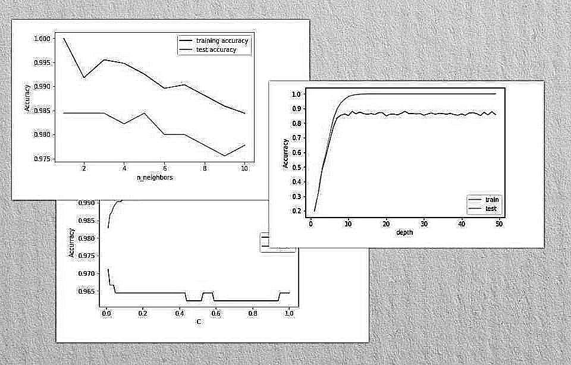

# Dss
Decision Support system project
### About
This is a three simple machine learning algorithms for decision support systems :

* logistic regression
* k-nearest neighbor classifier
* Decision Tree

We used scikit-learn 10-digits dataset (sklearn.datasets.load_digits)

| Key | Description |
| :---: | :---: |
| Classes | 10 |
| Samples per class |	~180 |
| Samples total |	1797 |
| Dimensionality |	64 |
| Features |	integers 0-16 |

### supported by plots for best hyperparameter we get :

